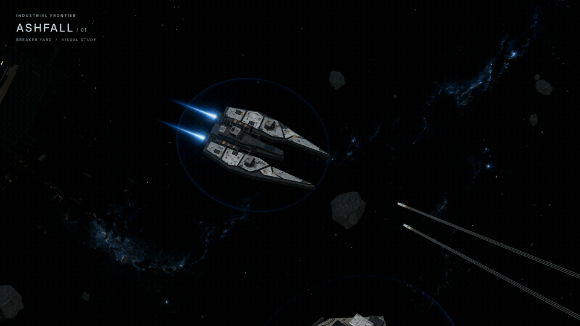
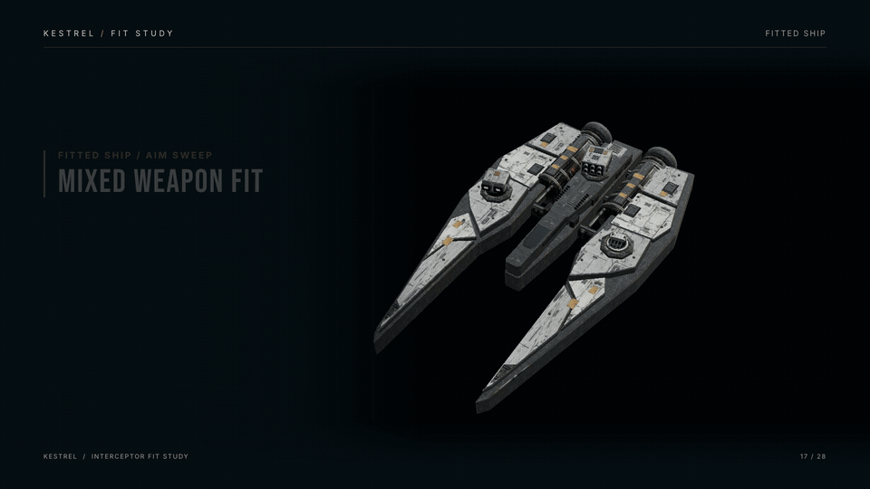

# Ashfall Brawler — local Three.js combat prototype

## Watch

Silent films made from the actual game and ship-fit prototypes. The animated previews play here; click a link to download the full 1080p MP4.

| Breaker's Yard combat · 30 seconds | Kestrel fit study · 28 seconds |
| --- | --- |
| [](https://raw.githubusercontent.com/wolfyy970/ashfall-brawler/main/media/breakers-yard-combat-silent.mp4) | [](https://raw.githubusercontent.com/wolfyy970/ashfall-brawler/main/media/kestrel-fit-study-silent.mp4) |
| [Download the full combat film (MP4)](https://raw.githubusercontent.com/wolfyy970/ashfall-brawler/main/media/breakers-yard-combat-silent.mp4) | [Download the full fit-study film (MP4)](https://raw.githubusercontent.com/wolfyy970/ashfall-brawler/main/media/kestrel-fit-study-silent.mp4) |

The full films are also available in [`media/`](media/).

Run this repository from a local static HTTP server, then open `http://127.0.0.1:8767/`. For example:

```sh
python3 -m http.server 8767
```

Three.js and its addons are vendored locally; no account, multiplayer service, or paid asset dependency is required.

Four scripted autonomous pilots: two interceptor hulls and two broader brawlers, four baked muted paint colors, three small mounted weapons each. Pulse lasers, railguns, projectile cannons, homing missiles and a slowing web have separate presentation paths. Shields, armor, capacitor, kills and redeployment are simulated.

Controls: Enter the wreckfield; Space pauses; R resets; C changes camera; H hides the HUD; scroll zooms; click a pilot card to follow. Sound starts only after the start button and can be muted.

This is an unfinished art prototype. It uses local scripted steering, not neural inference or multiplayer. The current focused art pass is the derelict station structure. Asteroids, shield impacts, weapon effects and exhaust still need their own reference-matching passes. No frame-rate or audio-mix quality claim is made.

The revised interceptor and brawler use the shallow dark angular canopy requested by the user, preserve textured team paint, and have three small hardpoints. No human reference models are exported.

Sources: original Blender models and built-in image-generated textures from this project. The project code and original assets are released under the BSD Zero Clause License (0BSD). The vendored Three.js files remain under their original MIT license in `vendor/LICENSE`.
